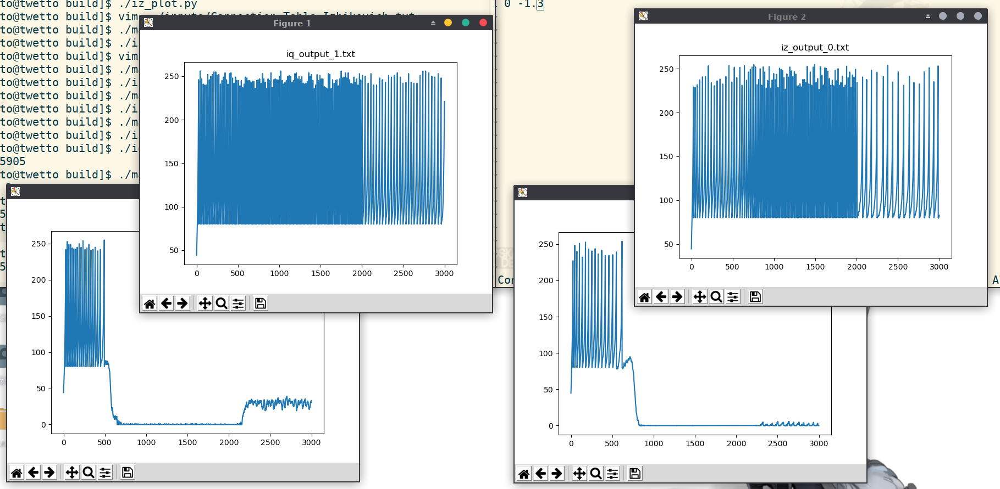

# Integer Quadratic Integrate-and-Fire Neuron

[](https://opensource.org/licenses/MIT)

Library for IQIF. A binary `libiq` for native C++ runtime and shared libraries `libiq-network`, `libiz-network`, and `liblif-network` are included. Please see below for running/installing instructions.

## Dependencies

### Runtime:

* OpenMP >= 4.5

* python3-matplotlib (plotting function)

### Buildtime:

* gcc (C++11)

* cmake >= 3.9

* checkinstall (Debian-based packaging)

* base-devel (Arch-based packaging)

## Compile & Run

Run the IQIF directly using `libiq` binary.

```bash
mkdir build && cd build
cmake ..
make -j
./libiq < ../inputs/session.txt (or use your custom session)
../utils/iq_plot.py
```

## Compile & Install Shared Libraries:

`libiq-network.so`, `libiz-network.so`, and `liblif-network.so` can be used for bridging to [python-iqif](https://github.com/twetto/python-iqif).

### Universal installation

```bash
mkdir build && cd build
cmake .. (-DCMAKE_INSTALL_PREFIX=<your preferred directory>)
make -j
sudo make install
```

### Debian-based installation

Instead of `sudo make install` you can use

```bash
sudo checkinstall --pkgname iq-neuron
```

Uninstall the package with `sudo dpkg -r iq-neuron`.

### Arch-based installation

First download the PKGBUILD, go to the working directory, then

```bash
makepkg -si
```

Uninstall the package with `sudo pacman -Rs iq-neuron`.

## Configuration

You can change the synaptic weights in the [Connection Table](inputs/Connection_Table_IQIF.txt). The numbers in each lines are `pre-synapse neuron index, post-synapse neuron index, weight, time constant` respectively.

You can change the neuron parameters in the [neuron parameter file](inputs/neuronParameter_IQIF.txt). The parameters in each lines are `neuron index, rest potential, threshold potential, reset potential, noise strength` respectively.

It is recommended to use multithreading only when number of neurons is large (>100 for example).

I also have [Izhikevich model](include/iz_network.h) and [Leaky integrate-and-fire model](include/lif_network.h) for comparison. They are already in the shared libs. You need to change the [main code](src/main.cpp) to let it work in binary though.



