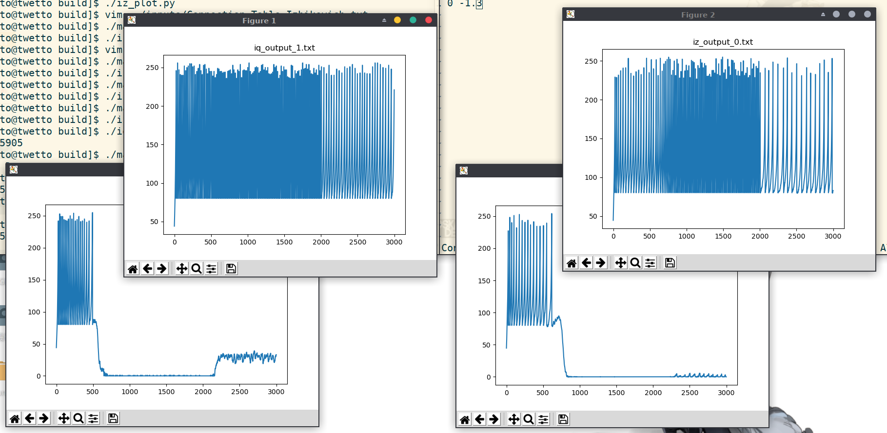

# Integer Quadratic Integrate-and-Fire Neuron

[](https://opensource.org/licenses/MIT)

Library for IQIF. A binary `libiq` for native C++ runtime and shared libraries `libiq-network`, `libiz-network`, and `liblif-network` are included. Please see below for running/installing instructions.

## Dependencies

### Runtime:

* OpenMP >= 4.5

* python3-matplotlib (plotting function)

### Buildtime:

* gcc (C++11)

* cmake >= 3.9

* checkinstall (Debian-based packaging)

* base-devel (Arch-based packaging)


## Compile & Install Shared Libraries:

`libiq-network.so`, `libiz-network.so`, and `liblif-network.so` can be used for bridging to [python-iqif](https://github.com/twetto/python-iqif).

### Universal installation

```bash
mkdir build && cd build
cmake .. (-DCMAKE_INSTALL_PREFIX=<your preferred directory>)
make -j
sudo make install
```

### Debian-based installation

Instead of `sudo make install` you can use

```bash
sudo checkinstall --pkgname iq-neuron
```

Uninstall the package with `sudo dpkg -r iq-neuron`.

### Arch-based installation

First download the PKGBUILD, go to the working directory, then

```bash
makepkg -si
```

Uninstall the package with `sudo pacman -Rs iq-neuron`.


## Configuration & Usage

Please see the [tutorial](tutorial/tutorial.md) first.

### Connection Table

You can change the synaptic weights in the [Connection Table](inputs/Connection_Table_IQIF.txt). The numbers in each line are:

```
pre-synapse_index  post-synapse_index  weight  time_constant
```

### Neuron Parameters

You can change the neuron parameters in the [neuron parameter file](inputs/neuronParameter_IQIF.txt). The parameters in each line are:

```
neuron_index  rest  threshold  reset  shift_a  shift_b  noise
```

Where:
- `rest`: resting potential
- `threshold`: firing threshold
- `reset`: reset potential after spike
- `shift_a`: bit-shift for leak dynamics (larger = slower leak toward rest)
- `shift_b`: bit-shift for push dynamics (larger = slower push toward threshold)
- `noise`: noise strength

**Dynamics rate mapping:**

| `shift` | Effective Rate |
|---------|----------------|
| 0       | 1              |
| 1       | 1/2            |
| 2       | 1/4            |
| 3       | 1/8            |
| 4       | 1/16           |

> **Note:** If upgrading from v0.2.x, see [MIGRATION.md](MIGRATION.md) for parameter conversion.

It is recommended to use multithreading only when number of neurons is large (>100 for example).

I also have [Izhikevich model](include/iz_network.h) and [Leaky integrate-and-fire model](include/lif_network.h) for comparison. They are already in the shared libs. You need to change the [main code](src/main.cpp) to let it work in binary though.




## Compile & Run

Run the IQIF directly using `libiq` binary. Use this method if you feel more comfortable with C++ instead of Python.

```bash
mkdir build && cd build
cmake ..
make -j
./libiq < ../inputs/session.txt (or use your custom session)
../utils/iq_plot.py
```
