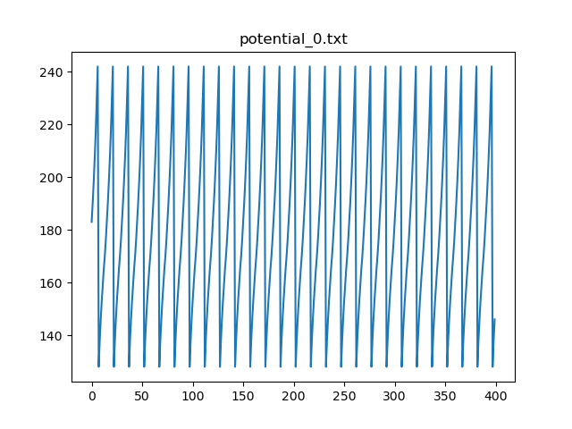

# Integer Quadratic Integrate-and-Fire Neuron Tutorial

## Installation

Please visit [iq-neuron](https://github.com/twetto/iq-neuron) and [python-iqif](https://github.com/twetto/python-iqif) for installation guide.

## Example Usage

First create configuration files:  
```bash
touch neuron_IQIF.txt table.txt
```

`neuron_IQIF.txt` is config for IQIF parameters. You can create other config files such like `neuron_Izhikevich.txt` or `neuron_LIF.txt` for different setups.

edit the `neuron_IQIF.txt`:  
```
0 128 200 128 1 1 0
```

As indecated in [iq-neuron README](https://github.com/twetto/iq-neuron/blob/master/README.md), each of the numbers is `neuron index, rest potential, threshold potential, reset potential, a, b, noise strength` respectively.

Right now we only have one neuron, so we can leave the `table.txt` empty. One can also add recurrent connection to it, but that is beyond this tutorial.

Now we are ready to play around. Let's enter python console first:  
```bash
python
```

First import the lib:  
```python
import iqif
```
You should see something like `All libs loaded. Congrats!`.

Create a network according to previously created configs:  
```python
net = iqif.iqnet("neuron_IQIF.txt", "table.txt")
print(net.num_neurons())
print(net.potential(0))
```

You can see python outputs `1` and `128` because there is one neuron in this network, and `128` is the rest potential we set in the `neuron_IQIF.txt` config.

Now we can add current input into this neuron:  
```python
net.set_biascurrent(0, 10)
```

Neuron `0` is now receiving `10` amount of current.

Start the simulation for 400 steps:  
```python
for i in range(400):
    net.send_synapse()
    print(net.potential(0))
```

You should see the potential for each timesteps. Alternatively, you can output the potential to a file for further plotting purpose:  
```python
fp = open("potential_0.txt", "a")
for i in range(400):
    net.send_synapse()
    fp.write('{:d}\n'.format(net.potential(0)))
fp.close()
```

Plot the potential using [iq\_plot.py](https://github.com/twetto/iq-neuron/blob/master/utils/iq_plot.py)(You may want to change `iq_output_*.txt` to `potential_0.txt`:  
```bash
python iq_plot.py
```



Notice that IQIF is in `int` type while Izhikevich and LIF are in `float` type, so you may want to plot them using [iz\_plot.py](https://github.com/twetto/iq-neuron/blob/master/utils/iz_plot.py).

And that's it! You are now able to do whatever you want to the network. I also have several example configs in the [inputs](https://github.com/twetto/iq-neuron/tree/master/inputs) directory. For example, [neuronParameter\_IQIF\_burst.txt](https://github.com/twetto/iq-neuron/blob/master/inputs/neuronParameter_IQIF_burst.txt) and [Connection\_Table\_IQIF\_bursting.txt](https://github.com/twetto/iq-neuron/blob/master/inputs/Connection_Table_IQIF_bursting.txt) are for burst firing pattern.

You might still have a lot of questions. If that's the case, feel free to ask:

`chen_fu_yeh@lolab-nthu.org`


